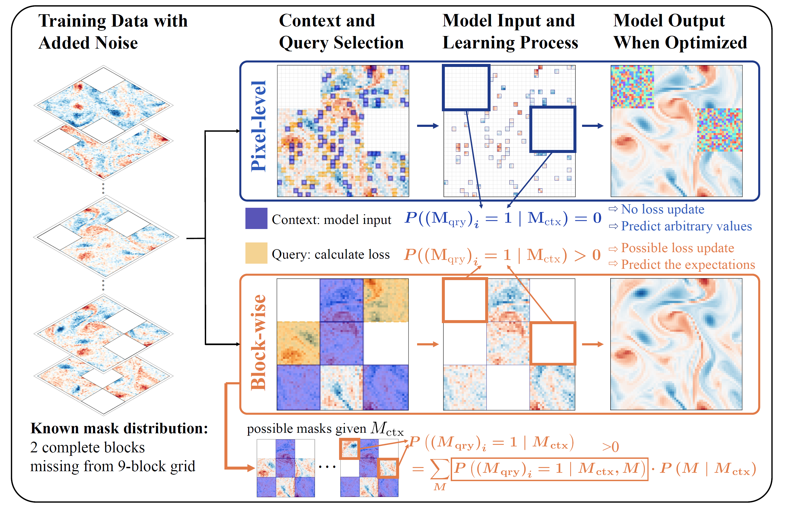

# Incomplete Data, Complete Dynamics: A Diffusion Approach

[](https://openreview.net/)
[](https://arxiv.org/abs/2509.20098)
[](https://opensource.org/licenses/MIT)

Official implementation of **"Incomplete Data, Complete Dynamics: A Diffusion Approach"** (ICLR 2026).

> **TL;DR:** A principled diffusion framework for learning physical dynamics from incomplete observations, with theoretical convergence guarantees.

<p align="center">
  
</p>

## 📖 Overview

Real-world physical measurements are inherently **sparse and incomplete**—sensor networks observe only discrete locations, satellites suffer from cloud occlusion, and experimental measurements are constrained by instrumental limitations. This work proposes a theoretically principled diffusion-based framework that learns complete dynamics directly from such incomplete training data.

### Key Contributions

- **Methodical Design:** A novel conditional diffusion training paradigm with strategic context-query partitioning tailored for physical dynamics
- **Theoretical Guarantee:** First theoretical analysis proving diffusion training on incomplete data asymptotically recovers the true complete distribution
- **Strong Results:** Substantial improvements over baselines on synthetic PDEs and real-world ERA5 climate data, especially in sparse regimes (1-20% coverage)

## 🔑 Core Method

### The Problem

Given a training dataset containing **only partial observations** (no complete samples available), learn a model that can reconstruct complete data from partial observations.

```math
\mathcal{D} = \{(\mathbf{x}^{(i)}_{\text{obs}}, \mathbf{M}^{(i)})\}_{i=1}^N
```

### Our Solution: Context-Query Partitioning

<!-- TODO: Add method figure here -->
<!--  -->

For each incomplete sample, we:
1. **Partition** observed data into **context** (model input) and **query** (loss calculation) components
2. **Train** a conditional diffusion model to reconstruct query portions given context
3. **Ensemble** multiple context masks at inference for complete reconstruction

The training objective:

```math
\mathcal{L}(t, \mathbf{x}_{\text{obs}}, \mathbf{M}_{\text{ctx}}, \mathbf{M}_{\text{qry}}) = \|\mathbf{M}_{\text{qry}} \odot (\mathbf{x}_\theta(t, \mathbf{M}_{\text{ctx}} \odot \mathbf{x}_{\text{obs},t}, \mathbf{M}_{\text{ctx}}) - \mathbf{x}_{\text{obs}})\|^2
```

### Critical Design Principle: Uniform Query Exposure

**Theorem (Key Insight):** The model learns meaningful conditional expectations for dimension $i$ **only when** the probability of that dimension being in the query set given the context is positive.

In other words: $P((\mathbf{M}\_{\text{qry}})\_i = 1 \mid \mathbf{M}\_{\text{ctx}}) > 0$

This means the context-query partitioning strategy **must match the observation pattern**:
- **Pixel-level observations** → Pixel-level context sampling
- **Block-wise observations** → Block-wise context sampling

<!-- TODO: Add partitioning strategy comparison figure here -->
<!--  -->

## ⚡ Implementation Notes

### You May Not Need This Code!

The method described in this paper is **straightforward to implement** and requires **no special tricks or hyperparameter tuning** beyond what is described in the paper. The core algorithm can be summarized as:

```python
# Training loop (pseudocode)
for x_obs, M in dataloader:
    t = uniform(0, 1)
    noise = randn_like(x_obs)
    x_obs_t = M * (alpha_t * x_obs + sigma_t * noise)
    
    # Key: Sample context/query masks following the SAME pattern as observation masks
    M_ctx, M_qry = sample_context_query_masks(M)  # Must satisfy Principle 1!
    
    x_pred = model(t, M_ctx * x_obs_t, M_ctx)
    loss = ((M_qry * (x_pred - x_obs)) ** 2).mean()
    loss.backward()
```

**The only critical requirement:** Your context-query sampling strategy must ensure every dimension has a positive probability of being queried. Match the sampling structure to your observation pattern.

### Ensemble Sampling at Inference

```python
# Single-step sampling (for well-constrained problems)
def impute(x_obs, M, model, K=10, delta=1e-3):
    x_delta = alpha_delta * x_obs + sigma_delta * randn_like(x_obs)
    predictions = []
    for _ in range(K):
        M_ctx = sample_context_mask(M)
        pred = model(delta, M_ctx * x_delta, M_ctx)
        predictions.append(pred)
    return mean(predictions)
```


## 📧 Contact

For questions, please open an issue or contact:
- Zihan Zhou: zihanzhou1@link.cuhk.edu.cn
- Tianshu Yu: yutianshu@cuhk.edu.cn

## 🙏 Acknowledgements

This work was supported by The Chinese University of Hong Kong, Shenzhen and Shanghai Artificial Intelligence Laboratory.

## 📄 License

This project is licensed under the MIT License - see the [LICENSE](LICENSE) file for details.
